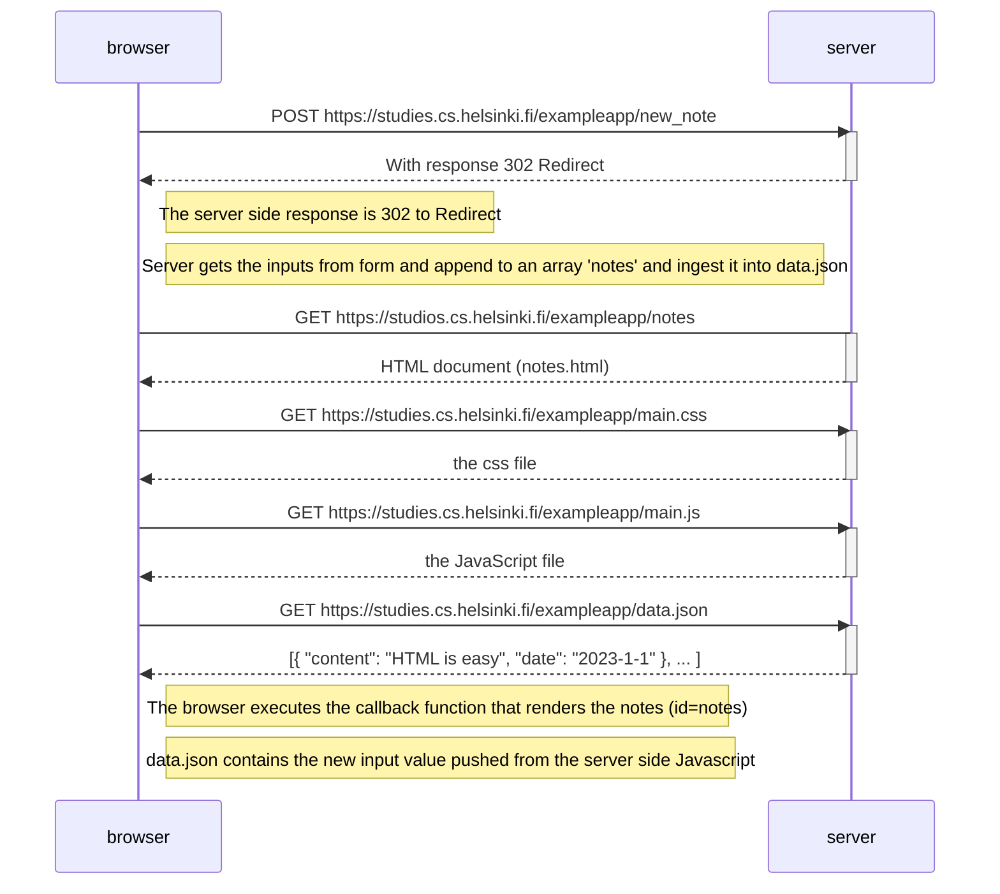

```mermaid

sequenceDiagram
    participant browser
    participant server

    browser->>server: POST https://studies.cs.helsinki.fi/exampleapp/new_note
    activate server
    server-->>browser: With response 302 Redirect
    deactivate server

    Note right of browser: The server side response is 302 to Redirect
    Note left of server: Server gets the inputs from form and append to an array 'notes' and ingest it into data.json

    browser->server: GET https://studios.cs.helsinki.fi/exampleapp/notes
    activate server
    server-->>browser: HTML document (notes.html)
    deactivate server

    browser->>server: GET https://studies.cs.helsinki.fi/exampleapp/main.css
    activate server
    server-->>browser: the css file
    deactivate server

    browser->>server: GET https://studies.cs.helsinki.fi/exampleapp/main.js
    activate server
    server-->>browser: the JavaScript file
    deactivate server

    browser->>server: GET https://studies.cs.helsinki.fi/exampleapp/data.json
    activate server
    server-->>browser: [{ "content": "HTML is easy", "date": "2023-1-1" }, ... ]
    deactivate server

    Note right of browser: The browser executes the callback function that renders the notes (id=notes)
    Note right of browser: data.json contains the new input value pushed from the server side Javascript


```