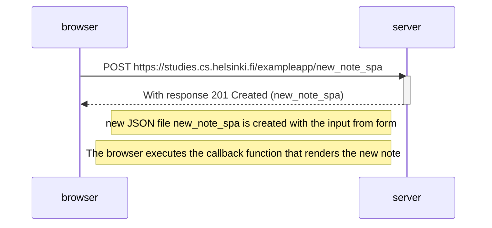

```mermaid

sequenceDiagram
    participant browser
    participant server

    browser->>server: POST https://studies.cs.helsinki.fi/exampleapp/new_note_spa
    activate server
    server-->>browser: With response 201 Created (new_note_spa)
    deactivate server

    Note left of server: new JSON file new_note_spa is created with the input from form
    Note right of browser: The browser executes the callback function that renders the new note


```